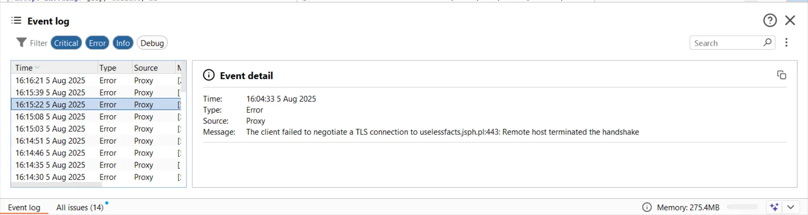
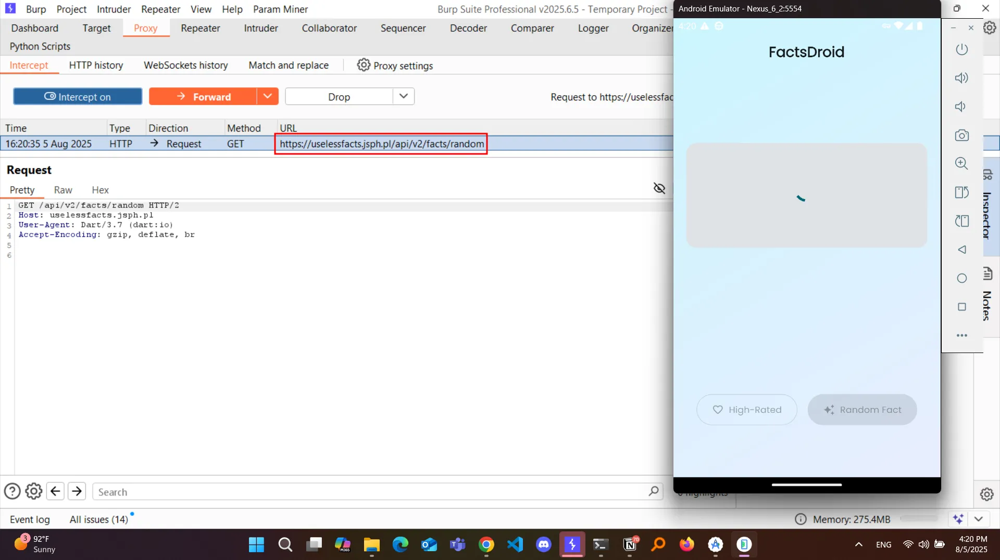
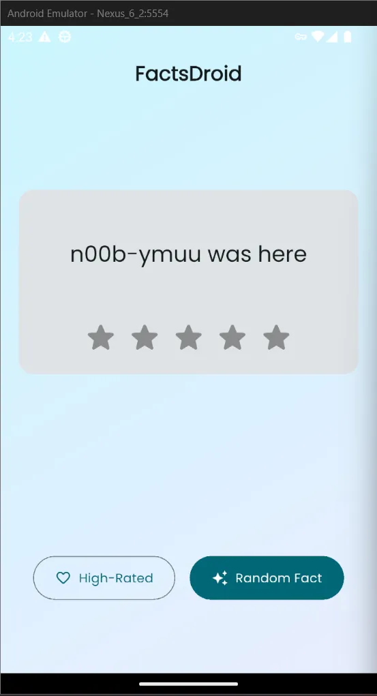

*( بِسْمِ اللَّـهِ الرَّحْمَـٰنِ الرَّحِيمِ )*

:::caution
 #FreePalastine
:::

---

## **FactsDroid: Your Universal Knowledgebase**

This challenge gives us a Flutter-based app, and from the description, the goal is simple: **intercept the network traffic and manipulate the *response*** to prove we’ve successfully intercepted the flow.

Since it’s a Flutter app, we already know it probably doesn’t respect proxy settings (i.e., not proxy-aware) by default — classic Flutter behavior.

---

### Step 1: Root Detection

First problem: the app **detects root**.

So yeah, you’re going to need to hide it. I used **Magisk with Zygisk + DenyList**, which worked perfectly.

---

### Step 2: Burp + Super Proxy Setup

Next, I spun up Burp Suite, set my proxy IP and port, and then opened **Super Proxy** on the Android emulator, pointing it to the same values.

Traffic started flowing.

But... yeah, here we go :”D:



---

### Step 3: TLS Handshake Failures

This error means we’ve got **SSL issues**. The app is refusing to connect through our proxy because it doesn’t trust our Burp certificate — **TLS Pinning** at work.

So then, I went down the usual rabbit hole of **basic SSL interception attempts**:

- Frida
- Objection
- Reflutter
- HTTP Toolkit
- Manual CA injection

**None of them worked.**

---

### Step 4: Realization

At this point I paused and asked myself:

> “Wait. This is a Flutter app. Why am I even using the usual SSL pinning bypass techniques?”
>

I *had* tried Reflutter earlier, but that made the app crash immediately. 🤨 Sus, right?

Still not sure if the crash was intentional on the dev’s part or just unlucky, but it was clearly a dead-end.

---

### Step 5: Flutter + Frida Magic

I started hunting for **Flutter-specific Frida bypasses**, and came across this gem:

🔗 [`disable-flutter-tls-verification`](https://github.com/NVISOsecurity/disable-flutter-tls-verification)

And bruh — **this thing is actual magic**.

Although it *did* throw me a warning that spooked me a bit at first:

```bash
[!] Flutter library not found. Possible reasons:
[!] - The application does not use Flutter
[!] - The application has not loaded the Flutter library yet
[!] - You are using an emulator + gadget (https://github.com/NVISOsecurity/disable-flutter-tls-verification/issues/43)

```

But I wasn’t using the gadget — just the Frida **server** on an emulator — so I was like “ehh... 50/50 chance?” 😅

Then finally:

```bash
[+] ssl_verify_peer_cert found at location: 0x77f398deec99
[+] ssl_verify_peer_cert has been patched
```

My eyes: 0_0

---

### Step 6: Interception Success

I quickly went back to the app, hit the "Get Random Fact" button — said a prayer — and **3 seconds later; the r**equest showed up in Burp.





---
