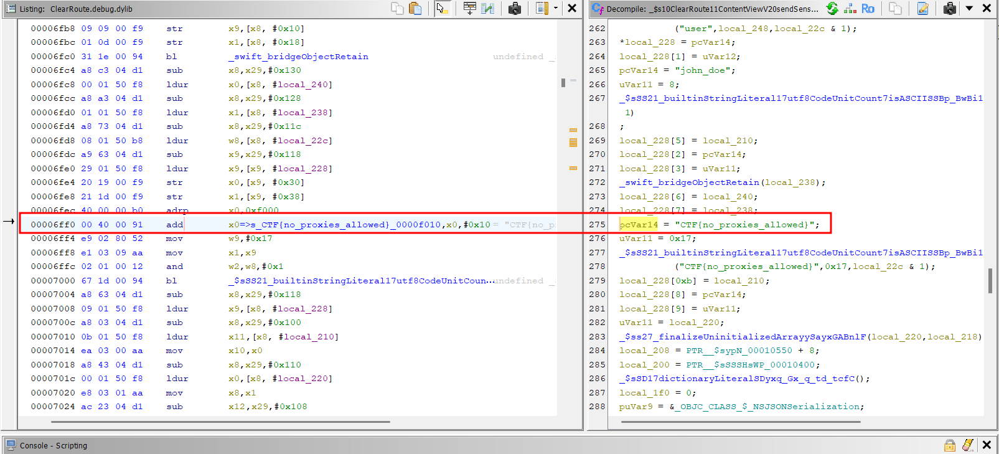
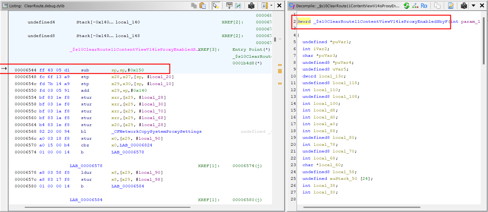
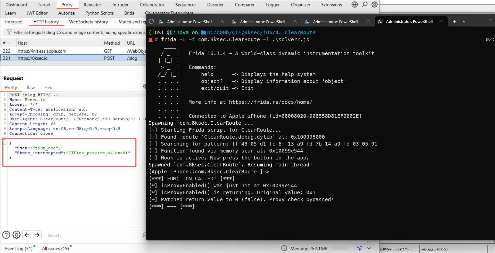

*( بِسْمِ اللَّـهِ الرَّحْمَـٰنِ الرَّحِيمِ )*

:::caution
FreePalestine
:::

---

# ClearRoute CTF Writeup: Bypassing Proxy Checks and the Case of the Missing Module

## 1. Initial Triage & The Problem

`ClearRoute`, is a simple `iOS` app with one button. The goal is to capture the `flag` sent in a network request.

However, when running the app with `Burp Suite`  enabled, tapping the button only shows an error: "Some Error Occured, Please Try again." Crucially, no request ever appears in the Burp Suite `logs`.

This immediately suggests the app has some form of anti-analysis or `proxy-detection` mechanism.

## 2. Static Analysis with Ghidra

I loaded the app's binary (`ClearRoute.debug.dylib`) into `Ghidra` to investigate.

### Finding the Check

By searching for the error `string` "Some Error Occured", I found the exact function responsible for this logic. `Ghidra` demangled the Swift function name to `ClearRoute.ContentView.checkForProxyAndSend()`:

```c
/* Decompiled function from Ghidra */
void _$s10ClearRoute11ContentViewV20checkForProxyAndSendyyF(uint param_1)
{
  // ... (setup code) ...
  
  // 1. The check is performed
  _$s10ClearRoute11ContentViewV14isProxyEnabledSbyF();
  
  // 2. The result is checked
  if ((param_1 & 1) == 0) {
    // 3. IF PROXY IS *NOT* ENABLED
    // ... (set UI to "Request Successful") ...

    // 4. THE REAL REQUEST IS SENT
    _$s10ClearRoute11ContentViewV20sendSensitiveRequestyyF();
  }
  else {
    // 5. IF PROXY *IS* ENABLED
    // ... (set UI to "Some Error Occured...") ...
    
    // Notice: sendSensitiveRequest() is NOT called!
  }
  return;
}
````

The analysis was clear and easy:

1. The app calls `isProxyEnabled()`.
2. If it returns `true`, the app shows an error and **never sends the request**.
3. If it returns `false`, it calls `sendSensitiveRequest()` to send the flag.

This is why Burp saw nothing. The app detected it and intentionally skipped the network call.

### Finding the Flag (Static Method)

A quick static-only solve was also possible. By analyzing the `sendSensitiveRequest` function, I could see the flag being hardcoded and loaded into the request body:

```assembly
; Inside sendSensitiveRequest()
; ...
; "8ksec" + "_int" + "er" + "cepted" = "8ksec_intercepted"
; ...
add     x0=>s_CTF{no_proxies_allowed}_0000f010 ,x0,#0x10 = "CTF{no_proxies_allowed}"
; ...
```



**Flag:** `CTF{no_proxies_allowed}`

But this is not the `intended` solution of course. The goal is to `bypass` the check and capture the request live.

## 3\. Dynamic Analysis & The Methodology of Failure

Our goal was simple: hook the `isProxyEnabled()` function with `Frida` and force it to always return `false` (0).

Since I am a `n00b`, I faced some troubles :"D

### Attempt 1: Hook by Name

I started with the most `straightforward` approach: hook the function by its `demangled` symbol name.

**Script:**

```javascript
const SYMBOL_NAME = "_$s10ClearRoute11ContentViewV14isProxyEnabledSbyF";
const module = Process.findModuleByName("ClearRoute"); // <-- The mistake here that I was hooking into the MainModule and not the debug.dylib which contained the logic code, however I tried a dumper soultion by thinking that the issue is with the findExportByName().
const isProxyEnabledAddr = module.findExportByName(SYMBOL_NAME);
// ... attach hook ...
```

**Result:**
`[-] error: Function not found by name.`

### Attempt 2: Hook by Address Offset

I knew from `Ghidra` that the function was at offset `0x6544`. So, I tried hooking its direct `memory address`.

**Script:**

```javascript
const MODULE_NAME = "ClearRoute"; // <-- Same dump mistake
const FUNCTION_OFFSET = 0x6544; 
const module = Process.findModuleByName(MODULE_NAME);
const isProxyEnabledAddr = module.base.add(FUNCTION_OFFSET);

Interceptor.attach(isProxyEnabledAddr, { /* ... */ });
```

**Result:**
`[+] Hook is active. Now press the button in the app.`

This was the most confusing part. The script ran with no error, but when I clicked the button nothing happened. No logs from our hook, and still no request in `Burp`. This was the critical clue.

## 4\. The Module Mismatch

I were stuck. The name-based `hook` failed, and the address-based hook *seemed* to work but did nothing. This suggested something fundamental was wrong with our assumptions.

I went back and looked at our `logs` and `Ghidra` side-by-side:

1. **In Ghidra:** The file I were analyzing was named `ClearRoute.debug.dylib`.
2. **In Frida:** Our scripts were targeting `Process.findModuleByName("ClearRoute")`.

**This was the mistake.**

`iOS` apps are often a small "stub" executable (e.g., `ClearRoute`) that then loads all the application logic from a separate dynamic library, or `.dylib` (e.g., `ClearRoute.debug.dylib`).

> Dump Mistake Leads to Dump Solution :3

## 5\. Targeting the Correct Module

So, I corrected our `script`. I only needed to change the module name I were searching for.

### The Working Script (Address Offset Method)

This script combines our two key pieces of information: the **correct offset** (`0x6544`) which is the starting offset address of the function we want to hook:


and the **correct module** (`ClearRoute.debug.dylib`).

```javascript
console.log("[+] Starting Frida script for ClearRoute...");

// The module NAME that contains the code
const MODULE_NAME = "ClearRoute.debug.dylib";

// Offset calculated from Ghidra (0x6544 - 0x0) 0x0 is the base address 
const FUNCTION_OFFSET = 0x6544; 

// 1. Find the app's *code* module.
const module = Process.findModuleByName(MODULE_NAME);

if (!module) {
    console.error("[-] Could not find module: " + MODULE_NAME);
} else {
    console.log("[+] Found module '" + MODULE_NAME + "' at: " + module.base);

    // 2. Calculate the function's real address in memory
    //    (Module Base + Offset)
    const isProxyEnabledAddr = module.base.add(FUNCTION_OFFSET);
    console.log("[+] Calculated isProxyEnabled() address: " + isProxyEnabledAddr);

    // 3. Attach an interceptor to that address
    Interceptor.attach(isProxyEnabledAddr, {
        onEnter: function(args) {
            console.log("\n[***] FUNCTION CALLED! [***]");
            console.log("[*] isProxyEnabled() was just hit at " + isProxyEnabledAddr);
            // you can delete the whole onEnter if you like clean shit code :"D
        },
        onLeave: function(retval) {
            console.log("[*] isProxyEnabled() is returning. Original value: " + retval);
            retval.replace(0); // Set return value to 0 (false)
            console.log("[+] Patched return value to 0 (false). Proxy check bypassed!");
            console.log("[***] --- [***]\n");
        }
    });

    console.log("[+] Hook is active. Now press the button in the app.");
}
```

### Exploit

Running this final `script`:

```powershell
    [+] Starting Frida script for ClearRoute...
    [+] Found module 'ClearRoute.debug.dylib' at: 0x100cd0000
    [+] Calculated isProxyEnabled() address: 0x100cd6544
    [+] Hook is active. Now press the button in the app.
    [*] isProxyEnabled() was just hit at 0x100cd6544
    [*] isProxyEnabled() is returning. Original value: 0x1
    [+] Patched return value to 0 (false). Proxy check bypassed!```


