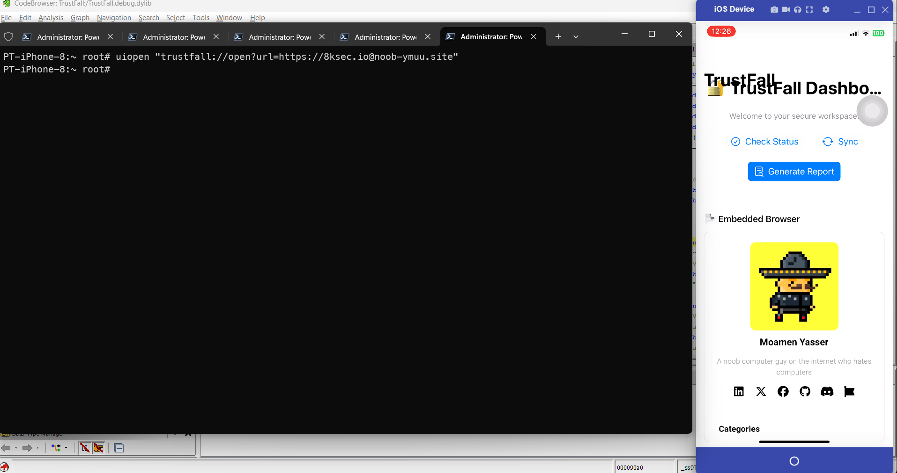

*( بِسْمِ اللَّـهِ الرَّحْمَـٰنِ الرَّحِيمِ )*

:::caution
FreePalestine
:::

---

# TrustFall CTF Writeup

TrustFall is a secure `iOS` workspace app that uses `deep linking` to load trusted content inside an embedded browser. It claims to only open links from approved `domains`, but its defenses aren’t as strong as they seem. Direct access to untrusted domains is `blocked` unless you find a `loophole`.

:::tip
Reading this [blog](https://8ksec.io/ios-deep-link-attacks-part-2-exploitation-8ksec-blogs) gives you a good start a head for understanding deeplinks and URL validaitons.
:::

## 1\. Reconnaissance: Identifying the Entry Point

The first step in any `iOS` challenge involving deep links is to identify **how** the application communicates with the outside world. I started by inspecting the application package in general and the `Info.plist` specificaly.

### 1.2 Analyzing Info.plist

I renamed `TrustFall.ipa` to `TrustFall.zip` and extracted it. Inside `Payload/TrustFall.app/`, I located the `Info.plist`.
Since `Info.plist` files in compiled apps are binary, I used `VS Code` with the `Binary Plist extension` to decode it. I searched for `CFBundleURLTypes` to find the registered scheme.

:::tip
Binary Plist Extension ID: `dnicolson.binary-plist`. You can search in `VSCode` with that ID.
:::

**Code Snippet (Info.plist):**

```xml
<key>CFBundleURLTypes</key>
<array>
    <dict>
        <key>CFBundleTypeRole</key>
        <string>Editor</string>
        <key>CFBundleURLName</key>
        <string>trustfall</string> //this is the one
        <key>CFBundleURLSchemes</key>
        <array>
            <string>trustfall</string>
        </array>
    </dict>
</array>
```

The app registers the custom URL scheme: `trustfall://`.

-----

## 2\. Static Analysis: Finding the Handler

With the `scheme` known, I needed to find the code that handles incoming `URLs`. I loaded the binary into `Ghidra` to perform static analysis.

### 2.1 Tracing the Delegate

Since modern iOS apps (SwiftUI) use `onOpenURL` or `SceneDelegate`, I searched the **Symbol Tree** for `onOpenURL`.

I found a "Thunk Function" (a bridge between the app and the system library) and checked its **Cross-References (XREFs)**.

**Ghidra Findings:**

```asm
_$s7SwiftUI4ViewPAAE9onOpenURL... XREF[3]: _$s9TrustFall11ContentViewV4body...
```

This XREF pointed us to `TrustFall.ContentView.body`.

### 2.2 Locating the Logic Closure

Inside `ContentView.body`, I analyzed the assembly instructions immediately preceding the call to `onOpenURL`. In ARM64, the `x0` register typically holds the first argument (or the closure pointer).

```asm
00008ca8 ... b ... _$s9TrustFall11ContentViewV4body...
...
00008878 ... bl ... _$s9TrustFall11ContentViewV17handleIncomingURL
```

I discovered that the closure was a wrapper calling a specific, named function:
**`_$s9TrustFall11ContentViewV17handleIncomingURL`** (Demangled: `TrustFall.ContentView.handleIncomingURL`).

-----

## 3\. Reverse Engineering the Logic

I navigated to `handleIncomingURL` function and analyzed the assembly to understand the parsing logic. I identified three distinct checks the app performs on the incoming URL.

### 3.1 The Scheme Check

The code first validates the `scheme`, the one which I already found in the `Info.plist`.

```asm
00008f30 ... bl ... _$s10Foundation3URLV6schemeSSSgvg  ; get url.scheme
00008f48 ... add ... = "trustfall"                      ; load "trustfall" string
00009000 ... bl ... _$sSS2eeoiySbSS_SStFZ               ; check if equal (==)
```

**Requirement 1:** URL must start with `trustfall://`.

### 3.2 The Host Check

Next, it checks the `host` portion of the deep link.

```asm
000090a0 ... bl ... _$s10Foundation3URLV4hostSSSgvg    ; get url.host
000090b8 ... add ... = "open"                           ; load "open" string
00009170 ... bl ... _$sSS2eeoiySbSS_SStFZ               ; check if equal (==)
```

**Requirement 2:** The host must be `open`.
**Current Payload:** `trustfall://open`

### 3.3 The Query Parameter & Sanitization

Finally, the app extracts a `query` parameter, identified as `url`, and performs what it thinks are `trust` checks.

Now here is a **crucial** part.
The order of those checks matters - to my n00b understanding.
The handler pulls the `url` query item, rebuilds a `Foundation.URL`, and then:

1. Runs `absoluteString.hasPrefix("https://8ksec.io")`. If this returns `true`, the function immediately treats the link as trusted—no additional validation runs.
2. Only when the prefix check fails does it fall back to fetching `parsedURL.host` and calling `.contains("8ksec.io")`.

Relevant decompiled snippet from `_$s9TrustFall11ContentViewV17handleIncomingURLyy10Foundation0G0VF`:

```asm
__s10Foundation3URLV14absoluteStringSSvg()
__sSS21_builtinStringLiteral... "https://8ksec.io"
__sSS9hasPrefixySbSSF();             ; sets local_32c
if ((local_32c & 1) == 0) {          ; only runs when hasPrefix == false
    __s10Foundation3URLV4hostSSSgvg()
    __sSy10FoundationE8containsySb... "8ksec.io"
    ...                              ; sets local_38c based on contains()
}
```

**The Logic Flaw:**
Because a successful prefix check short-circuits the rest of the logic, *any* string that begins with `https://8ksec.io` is considered trusted—even if the actual host resolves somewhere else. The later `.contains("8ksec.io")` never runs for those cases, so crafted usernames (e.g., `https://8ksec.io@evil.com`) slide straight through.

-----

## 4\. Exploitation: The Authority Bypass

I utilized a **URL Parsing Confusion** attack. This relies on the fact that the `Foundation.URL` parser (used for the check) and the `WKWebView` (used for navigation) handle the `@` symbol differently.

The `@` symbol is used to denote `user:password@host`.

:::tip
Understanding URLs can be somehow confusing, better watch this [video](https://www.youtube.com/watch?v=0uejy9aCNbI)
:::

### Payload

I constructed a URL that contains the allowed domain as the "User" credentials, but points to our target domain as the "Host".

**Payload:**

```text
trustfall://open?url=https://8ksec.io@noob-ymuu.site
```

### Why this works

1. **The Validator (`Foundation.URL`):**

    - Computes `absoluteString` and sees it starts with `https://8ksec.io`.
    - The `hasPrefix` check returns **TRUE**, so the handler **never** evaluates the host-based `.contains` branch.
    - The app considers the URL “safe” and stores it in state for the embedded web view.

2. **The Executor (`WKWebView` / Browser):**

    - Receives `https://8ksec.io@noob-ymuu.site`.
    - Treats `8ksec.io` as `username@` (per RFC 3986 authority syntax).
    - Treats `noob-ymuu.site` as the actual network host.
    - **Action:** Ignores the username and loads `noob-ymuu.site`, should reveal the flag - but it did not :( .

## 5\. Delivery

To verify the exploit, I sent the payload to the iOS Simulator using `SSH` and `uiopen`:

```powershell
uiopen "trustfall://open?url=https://8ksec.io@noob-ymuu.site"
```

:::tip
You can just write the `payload` in a `Safari` tab and will work too.
:::

**Result:** The app opened and the WebView successfully loaded `noob-ymuu.site` instead of the restricted `8ksec.io`, confirming the logic bypass.



### Why did not the flag show?

The `CTF{bad_url_sanitization}` flag was present in hardcoded in `Ghidra`:

```asm
00009740 00  00  0c  91 add  x0=>s_CTF{bad_url_sanitization}_00014300 ,x0,# = "CTF{bad_url_sanitization}"
```

However, even though I successfully exploited the `deeplink`, I couldn’t get it to trigger the `flag` or appear in the UI. I’m not sure what I might be missing, but overall the lessons learned were valuable; and that’s what matters most.
