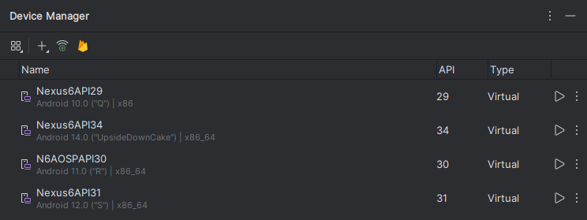

# ( بِسْمِ اللَّـهِ الرَّحْمَـٰنِ الرَّحِيمِ )
:::caution
 #FreePalastine
:::

## Intro

Recently, I've been exploring Android hacking and testing. While it's been quite enjoyable, I've faced challenges with setting up the environment—specifically with emulators.

I've experimented with several emulators, and here's my honest feedback:

1. Genymotion → extremely buggy
2. NOX → reminiscent of Bluestacks (if you know what I mean)
3. VM with x86 Image → lacks user-friendliness
4. Android Studio → requires excessive computing power

## Issue and Resolution

While each emulator has its share of bugs and issues, Android Studio proved to be the most reliable. However, the main drawback was needing to launch the entire IDE just to run the emulator. I wondered if there was a way to run the Android Emulator (Android Device Manager) without launching the full IDE and consuming unnecessary resources. After seeing this capability on Linux and MacOS, I decided to explore the possibility for Windows.

This is exactly what I'll guide you through today.

## Why Android Studio?

It's the most comprehensive emulator available for penetration testing needs. It offers numerous APIs and diverse image types, including both rooted and non-rooted versions, with or without GApps, and supports various mobile screen sizes.

## Steps

:::important
If you already have Android Studio installed, please skip to the IMPORTANT PART
:::

First, we need to install Android Studio → [LINK](https://developer.android.com/studio)

After installation, open Android Studio and navigate to the Device Manager

Find it in the top-left menu: Tools → Device Manager



As you can see, I've set up several devices, mostly Nexus 6. Why? This device offers root options with minimal issues, though without GApps. For CTFs, you won't really need GApps, but for real penetration testing scenarios, you definitely will. 

Now click the Plus Icon and select "Create Virtual Machine"


here type nexus 6 and click next


Here you'll see a variety of options to choose from. Select whichever API you want to test on, including AOSP and GApps


After downloading and selecting your preferred option, click Next 

## IMPORTANT PART

Here comes an important part: When selecting the name, avoid using any spaces to make it easier to use later. Make sure to copy this name.


Next, scroll down and uncheck "Enable device frame".


If you click on Advanced Settings, you'll see the system hardware configuration. If you're not familiar with these settings, it's best to leave them as they are. Click Finish when you're done.

Now that you have your emulator set up, note that the AVD manager is **MOSTLY** installed in this directory

```powershell
C:\Users\%USERPROFILE%\AppData\Local\Android\Sdk\emulator\
```

To run the emulator, use:

```powershell
C:\Users\%USERPROFILE%\AppData\Local\Android\Sdk\emulator\emulator
```

To launch a specific emulator in PowerShell (without quotes), use:

```powershell
C:\Users\%USERPROFILE%\AppData\Local\Android\Sdk\emulator\emulator -avd "nameofAVD"
```

Simply enter this command in a PowerShell terminal to start the emulator without running Android Studio.

For convenience, you can save these commands for different APIs in a `.bat` file like this:


:::warning
Happy APK Hacking
:::