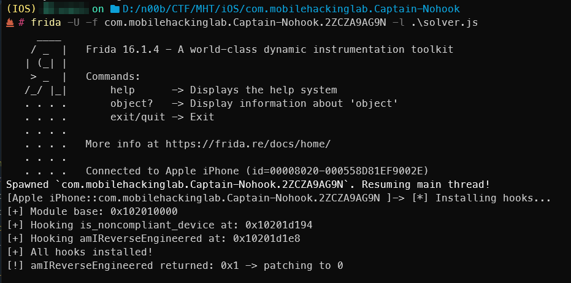
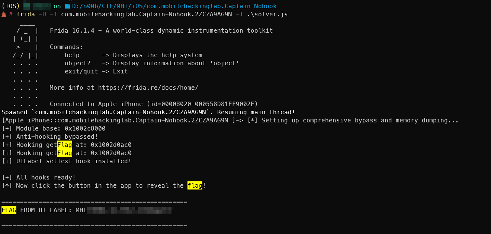

*( بِسْمِ اللَّـهِ الرَّحْمَـٰنِ الرَّحِيمِ )*

:::caution
 #FreePalestine
:::

---

## Captain Nohook

### Overview

I'm solving this iOS challenge, which is an anti-debug/anti-hooking scenario. It's a simple app with a button to reveal the flag if hooking isn't detected.

## Dynamic analysis

First things first, I ran the app with frida-trace and got this:

### Frida trace output

```text
Started tracing 129 functions. Press Ctrl+C to stop.
    7696 ms  dyld_dlsym_hook()
                     /* TID 0x3a03 */
    7697 ms  dyld_dlopen_from_hook()
                     /* TID 0x103 */
    7727 ms  $s14Captain_Nohook14ViewControllerC11whereIsflagyySo8UIButtonCF()
    7728 ms     | $s14Captain_Nohook14ViewControllerC4flagSo7UILabelCSgvg()
    7728 ms     | $s14Captain_Nohook14ViewControllerC7getFlagSSyF()
    7728 ms     |    | $s14Captain_Nohook22is_noncompliant_deviceSbyF()
    7728 ms     |    |    | $s14Captain_Nohook30ReverseEngineeringToolsCheckerCMa()
    7728 ms     |    |    | $s14Captain_Nohook30ReverseEngineeringToolsCheckerC20amIReverseEngineeredSbyFZ()
    7728 ms     |    |    |    | $s14Captain_Nohook11FailedCheckOMa()
    7728 ms     |    |    |    | $s14Captain_Nohook11FailedCheckO8allCasesSayACGvgZ()
    7728 ms     |    |    |    |    | dyld_dlsym_hook()
    7729 ms     |    |    |    | $s14Captain_Nohook11FailedCheckOMa()
    7729 ms     |    |    |    | $s14Captain_Nohook11FailedCheckOMa()
    7735 ms     |    |    |    | dyld_dlsym_hook()
    7735 ms     |    |    |    | dyld_dlsym_hook()
    7735 ms     |    |    |    | dyld_dlsym_hook()
    7735 ms     |    |    |    | dyld_dlsym_hook()
    7755 ms     |    |    |    | $s14Captain_Nohook11FailedCheckOMa()
    7755 ms     |    |    |    | $s14Captain_Nohook30ReverseEngineeringToolsCheckerC0cdE6StatusV6passed12failedChecksAESb_SayAA11FailedCheckO5check_SS11failMessagetGtcfC()
    7761 ms     |    | dyld_dlopen_hook()
    7761 ms     |    |    | dyld_dlopen_from_hook()
    7773 ms     | $s14Captain_Nohook14ViewControllerC4flagSo7UILabelCSgvg()
    7779 ms  dyld_dlopen_hook()
    7779 ms     | dyld_dlopen_from_hook()
    7779 ms  dyld_dlsym_hook()
    7779 ms  dyld_dlsym_hook()
    7779 ms  dyld_dlsym_hook()
    7779 ms  dyld_dlsym_hook()
```

### Execution path (demangled)

The demangled Swift function names reveal the execution path:

- `whereIsflag()` — button click handler that initiates flag retrieval
- `getFlag()` — attempts to retrieve the flag text
- `is_noncompliant_device()` — checks if the device is compromised or monitored
- `ReverseEngineeringToolsChecker.amIReverseEngineered()` — core detection method for hooking frameworks
- `FailedCheck.allCases()` — enumerates all anti-reversing checks to perform

### Primary targets

The most interesting ones are:

1. `is_noncompliant_device`
2. `amIReverseEngineered`

## Static analysis (Ghidra)

When I looked in Ghidra:

```c
// Variant seen in decompiler
undefined8 _$s14Captain_Nohook30ReverseEngineeringToolsCheckerC20amIReverseEngineeredSbyFZ
                        (undefined8 param_1, undefined8 param_2)
{
    _$s14Captain_Nohook30ReverseEngineeringToolsCheckerC13performChecks33_75B14952DDFE2A78282659A6E004BB4ALLAC0cdE6StatusVyFZ();
    _swift_bridgeObjectRelease(param_2);
    return 0;
}
```

```c
// Another decompiler view
dword _$s14Captain_Nohook30ReverseEngineeringToolsCheckerC20amIReverseEngineeredSbyFZ
                            (dword param_1, undefined8 param_2)
{
    _$s14Captain_Nohook30ReverseEngineeringToolsCheckerC13performChecks33_75B14952DDFE2A78282659A6E004BB4ALLAC0cdE6StatusVyFZ();
    _swift_bridgeObjectRelease(param_2);
    return (param_1 ^ 1) & 1;
}
```

### `is_noncompliant_device()`

```c
return dVar1 & 1; // Returns 0 (false)
```

This always returns 0 (false) because dVar1 is initialized to 0 and never modified. The call to amIReverseEngineered() happens, but its return value is ignored. This looks like decompiler confusion or the result is stored elsewhere.

### `amIReverseEngineered()`

```c
performChecks();        // Executes all checks
return (param_1 ^ 1) & 1; // Inverts the result
```

It calls performChecks() and then inverts the result with XOR 1. If checks pass (1), it returns 0. If checks fail (0), it returns 1.

### `performChecks()` orchestrator

So we need to understand `performChecks()`. Using Ghidra: it implements a check orchestrator that runs multiple anti-debugging/anti-hooking tests.

- Initialization: tracks overall pass/fail and collects failed checks
- Get all checks: FailedCheck.allCases() returns an array of 10 check types [0..9]
- Iterate: loops through each check via IndexingIterator
- Execute: a switch dispatches specific detection functions
- Collect failures: failed checks are pushed into the array
- Return: a status struct with overall result and failed list

### The switch statement logic

Only 4 out of 10 cases are handled explicitly:

```text
case 1: checkExistenceOfSuspiciousFiles()
case 6: checkDYLD()
case 7: checkOpenedPorts()
case 8: checkPSelectFlag()
default: loop back (cases 0,2,3,4,5,9 do nothing)
```

What each check does:

- Case 1 — `checkExistenceOfSuspiciousFiles()`: looks for Frida-related files like /usr/lib/frida-gadget.dylib, Cydia paths, jailbreak artifacts
- Case 6 — `checkDYLD()`: checks loaded dynamic libraries via dyld; looks for FridaGadget.dylib, MobileSubstrate libs, other hooks
- Case 7 — `checkOpenedPorts()`: scans for open ports (Frida server often 27042)
- Case 8 — `checkPSelectFlag()`: checks the P_TRACED flag via sysctl for debugger detection

### Return logic

Looking back at `amIReverseEngineered()`:

```c
return (param_1 ^ 1) & 1; // XOR inverts the result
```

And `is_noncompliant_device()`:

```c
return dVar1 & 1; // Always returns 0
```

The decompiler seems confused. The actual logic should be: if any of the 4 tests fail, the device is considered "reverse engineered". But do we really need to resolve all of that?

As you can see, `amIReverseEngineered()` returns that inverted value. If we patch it to return 0, we likely pass the checks and get the flag.

## Bypass with Frida hooks

So, a simple Frida script:

```javascript
setTimeout(function () {
    console.log("[*] Installing hooks...");

    var module = Process.findModuleByName("Captain Nohook");
    if (!module) {
        console.log("[-] Module not found");
        return;
    }

    console.log("[+] Module base: " + module.base);

    // Hook 1: amIReverseEngineered at offset 0xd1e8 (or find by symbol)
    // Hook 2: is_noncompliant_device at offset 0xd194
    var hooks = [
        { name: "is_noncompliant_device", offset: 0xd194 },
        { name: "amIReverseEngineered", offset: 0xd1e8 },
    ];

    hooks.forEach(function (hook) {
        var addr = module.base.add(hook.offset);
        console.log("[+] Hooking " + hook.name + " at: " + addr);

        try {
            Interceptor.attach(addr, {
                onLeave: function (retval) {
                    if (retval.toInt32() !== 0) {
                        console.log(
                            "[!] " + hook.name + " returned: " + retval + " -> patching to 0"
                        );
                        retval.replace(0);
                    }
                },
            });
        } catch (e) {
            console.log("[-] Failed to hook " + hook.name + ": " + e);
        }
    });

    console.log("[+] All hooks installed!");
}, 1000);
```



But surprisingly, there was no flag printed. I thought something was wrong, but the app didn't crash and the hooks were installed successfully and returned the patched values. So where is it printed?

### Solver - Memory dump

Instead of digging through long functions in Ghidra, I tried dumping memory (most return values are there — see the Q&A at the end). It worked :"D (also the challenge description mentions the flag will be in memory).

```javascript
setTimeout(function () {
    console.log("[*] Setting up comprehensive bypass and memory dumping...");

    var module = Process.findModuleByName("Captain Nohook");
    if (!module) {
        console.log("[-] Module not found");
        return;
    }

    console.log("[+] Module base: " + module.base);

    // 1) Bypass all detection functions
    module.enumerateSymbols().forEach(function (symbol) {
        if (!symbol.address.isNull()) {
            if (
                symbol.name.indexOf("is_noncompliant_device") !== -1 ||
                symbol.name.indexOf("amIReverseEngineered") !== -1
            ) {
                try {
                    Interceptor.attach(symbol.address, {
                        onLeave: function (retval) {
                            retval.replace(ptr(0));
                        },
                    });
                } catch (e) {}
            }
        }
    });

    console.log("[+] Anti-hooking bypassed!");

    // 2) Hook getFlag to capture the decrypted flag string
    module.enumerateSymbols().forEach(function (symbol) {
        // Look for the exact getFlag function (no parameters)
        if (symbol.name === "$s14Captain_Nohook14ViewControllerC7getFlagSSyF") {
            console.log("[+] Hooking getFlag at: " + symbol.address);

            Interceptor.attach(symbol.address, {
                onLeave: function () {
                    // Swift String is returned as a struct: { pointer, length }
                    // ARM64 calling convention: x0 = pointer to data, x1 = length/metadata
                    var stringPtr = this.context.x0;
                    var stringLen = this.context.x1.toInt32();

                    if (!stringPtr.isNull() && stringLen > 0) {
                        try {
                            var flagString = stringPtr.readUtf8String(stringLen);
                            console.log("\n" + "=".repeat(50));
                            console.log("FLAG FOUND: " + flagString);
                            console.log("=".repeat(50) + "\n");
                        } catch (e) {
                            console.log("[!] Error reading string: " + e);
                        }
                    }
                },
            });
        }
    });

    // 3) Also hook UILabel setter to see what's displayed
    if (ObjC.available) {
        try {
            var UILabel = ObjC.classes.UILabel;
            Interceptor.attach(UILabel["- setText:"].implementation, {
                onEnter: function (args) {
                    try {
                        var text = new ObjC.Object(args[2]).toString();
                        if (text.length > 5 && text.indexOf("MHL") !== -1) {
                            console.log("\n" + "=".repeat(50));
                            console.log("FLAG FROM UI LABEL: " + text);
                            console.log("=".repeat(50) + "\n");
                        }
                    } catch (e) {}
                },
            });
            console.log("[+] UILabel setText hook installed!");
        } catch (e) {
            console.log("[!] Could not hook UILabel: " + e);
        }
    }

    console.log("\n[+] All hooks ready!");
    console.log("[*] Now click the button in the app to reveal the flag!");
}, 1500);
```

### Alternative: patching the IPA

There was another approach: patching the IPA and forcing these functions to return 0 as well — but who doesn't love JavaScript? :"D



## Where in Ghidra (The Reversed Code) can I see that the flag will be in the memory dump?

It's not explicitly stated as "the flag will be printed in a memory dump" — it's deduced by how functions return values in compiled code. Here's how you can see it in Ghidra.

1. Function signature

```c
undefined [16] _$s14Captain_Nohook14ViewControllerC7getFlagSSyF(void)
```

The key part is `undefined [16]`. The function returns a 16-byte structure, not a simple int or pointer. Swift `String` is returned as two 8-byte words (data pointer and length/metadata), which strongly suggests the string's components are returned. The function involved here is `getFlag()`.

1. The return statement

```c
local_408 = local_418;
local_400 = local_410;
// ...
auVar1.*8_8* = local_400; // second 8 bytes
auVar1.*0_8* = local_408; // first 8 bytes
return auVar1;
```

This prepares the 16-byte return value by filling its two halves:

- `auVar1.*0_8*` gets the pointer to the decrypted string data
- `auVar1.*8_8*` gets the length/metadata

1. Assembly confirmation

```text
; (Code that calculates the decrypted string pointer and length)
...
mov x0, x20  ; move string pointer into x0
mov x1, x21  ; move string length/metadata into x1
ret          ; return
```

Even if the decompiler shows locals (local_408, local_400), the assembly shows the final move into x0/x1. That's the ARM64 ABI: the combination of x0 and x1 is your "memory dump" — enough to reconstruct the string.

---
