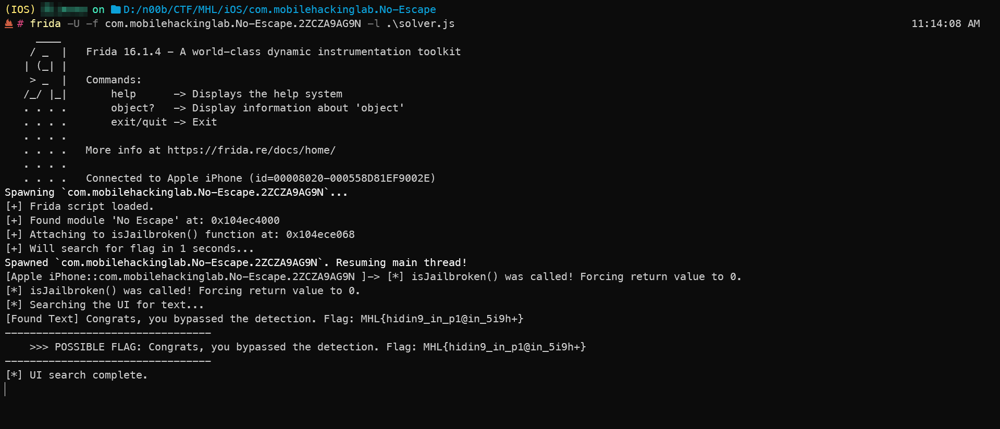

*( بِسْمِ اللَّـهِ الرَّحْمَـٰنِ الرَّحِيمِ )*

:::caution
 #FreePalastine
:::

---

## **No-Escape: You Can't Trivial-Bypass This**

This challenge gives us an iOS app, "No-Escape". The goal is simple: get the flag. The problem: the app detects our jailbroken device and **quits instantly**.

This is clearly a jailbreak check. Easy, right?

...Right?

---

### Step 1: The Standard Objection Fail

First problem: the app **detects jailbreak**.

So I fired up Objection, the usual go-to, and tried to hook the app on spawn to disable the check before it could even run.

```bash
objection -g 'com.mobilehackinglab.No-Escape' explore --startup-command 'ios jailbreak disable'
```

Result: **Crash.**

So yeah, the generic bypass isn't going to cut it. This thing is custom-rolled.

---

### Step 2: To the Disassembler\

If the front door is locked, we check the windows. I loaded the app's binary into a disassembler to see what it's *actually* doing.

It didn't take long to find the jackpot: a 'manager' function called `_$s9No_Escape12isJailbrokenSbyF`.

This function was just a wrapper that called a bunch of *other* checks. This is the code that ran right before the first check:

```arm64
   10000a068 ff 83 00 d1     sub     sp,sp,#0x20
   ...
   10000a074 29 00 00 94     bl      _$s9No_Escape22checkForJailbreakFiles...
   10000a078 a0 00 00 36     tbz     w0,#0x0,LAB_10000a08c
```

This confirmed it: the app wasn't using a simple high-level API. It was running its own list of checks.

-----

### Step 3: The Realization

At this point I paused and asked myself:

> "Why am I trying to patch every little check like `fileExistsAtPath:`? I should just kill the manager."

The plan was simple: hook the main `isJailbrokenSbyF` function and force it to return `false` (0) before it could report anything. All checks bypassed, one hook.

-----

### Step 4: Frida vs. The Binary

I wrote a simple Frida script to hook the function. This is where the *real* fun began.

**Attempt 1: Hook by Name.**
`Module.findExportByName("_$s9No_Escape12isJailbrokenSbyF")`
**Fail.** It's an internal Swift symbol, not an export.

**Attempt 2: Hook by Address.**
`Module.findBaseAddress('No_Escape')`
**Fail.** Wrong binary name.

At this point I was like... what is this thing even *called*?

-----

### Step 5: Finding the Real Name

I used a quick Frida script to just dump *all* the modules the app was loading.

```javascript
Process.enumerateModules().forEach(function(module) {
    console.log(module.name + " -> " + module.path);
});
```

And there it was, right in the console:

```bash
Listing all modules...
No Escape -> /private/var/containers/Bundle/Application/.../No Escape.app/No Escape
```

The binary name was `'No Escape'`, *with a space*. dumb me :"D

-----

### Step 6: The Bypass & The Flag

I updated my solver script one last time with the correct binary name and the function offset (`0xa068`).

```javascript
/*
  solver.js

  This script does two things:
  1. Bypasses the isJailbroken() check immediately on launch.
  2. Waits 1 seconds, then automatically searches the UI for the flag.
*/

(function() {
    console.log("[+] Frida script loaded.");

    // --- Part 1: Jailbreak Bypass ---
    // Hooks the isJailbroken() function by its memory offset.
    
    var binaryName = 'No Escape'; // The binary name you found
    var baseAddr = Module.findBaseAddress(binaryName); 

    if (baseAddr) {
        var funcOffset = 0xa068; // The offset you found: 10000a068 - 100000000
        var funcPtr = baseAddr.add(funcOffset);

        console.log("[+] Found module '" + binaryName + "' at: " + baseAddr);
        console.log("[+] Attaching to isJailbroken() function at: " + funcPtr);

        Interceptor.attach(funcPtr, {
            onLeave: function(retval) {
                // This function runs just before isJailbroken() returns.
                // We force its return value to 0 (false).
                console.log("[*] isJailbroken() was called! Forcing return value to 0.");
                retval.replace(0); 
            }
        });
    } else {
        console.log("[!] FAILED to find module base address for '" + binaryName + "'. Bypass failed.");
    }

    // --- Part 2: Flag Finder Function ---
    // Just to print the flag to terminal, sometimes I do love AI.
    
    function findFlag() {
        console.log("[*] Searching the UI for text...");

        function dumpView(view) {
            // Check for labels, textfields, etc.
            if (view.isKindOfClass_(ObjC.classes.UILabel) ||
                view.isKindOfClass_(ObjC.classes.UITextField) ||
                view.isKindOfClass_(ObjC.classes.UITextView)) {

                var text = view.text();
                if (text) {
                    var textStr = text.toString();
                    if (textStr.length > 0) {
                         console.log("[Found Text] " + textStr);
                        // Check for things that look like a flag
                        if (textStr.includes('MHL{') || textStr.includes('flag{') || textStr.length > 20) {
                            console.log("---------------------------------");
                            console.log("    >>> POSSIBLE FLAG: " + textStr);
                            console.log("---------------------------------");
                        }
                    }
                }
            }

            // Check for buttons
            if (view.isKindOfClass_(ObjC.classes.UIButton)) {
                var title = view.titleForState_(0); // 0 = UIControlStateNormal
                 if (title) {
                    var titleStr = title.toString();
                    if (titleStr.length > 0) {
                        console.log("[Found Button] " + titleStr);
                    }
                 }
            }

            // Recurse into subviews
            var subviews = view.subviews();
            if (!subviews) return;
            
            for (var i = 0; i < subviews.count(); i++) {
                dumpView(subviews.objectAtIndex_(i));
            }
        }

        // All UI code must run on the main thread
        ObjC.schedule(ObjC.mainQueue, function() {
            var window = ObjC.classes.UIApplication.sharedApplication().keyWindow();
            if (window) {
                dumpView(window); // Start the dump from the top
                console.log("[*] UI search complete.");
            } else {
                console.log("[!] Could not find the app's keyWindow. Search failed.");
            }
        });
    }

    // --- Part 3: Auto-Run the Flag Finder ---
    // This automatically calls findFlag() after 1000ms (5 seconds).
    console.log("[+] Will search for flag in 1 seconds...");
    setTimeout(findFlag, 1000);

})(); // We wrap the whole script in a function and call it immediately.
```

I ran Frida one last time:

```bash
frida -U -f com.mobilehackinglab.No-Escape... -l solver.js
```

The app launched. No crash. And the flag appeared right on the screen.


